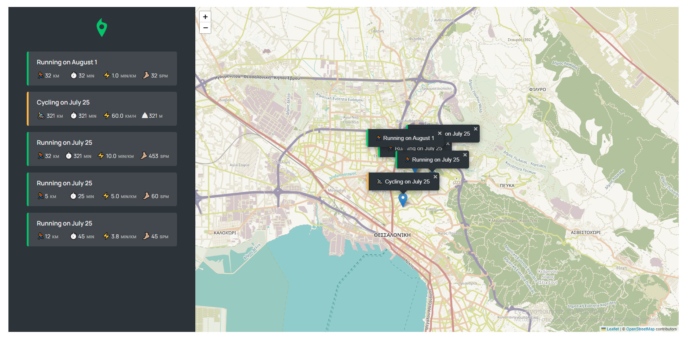
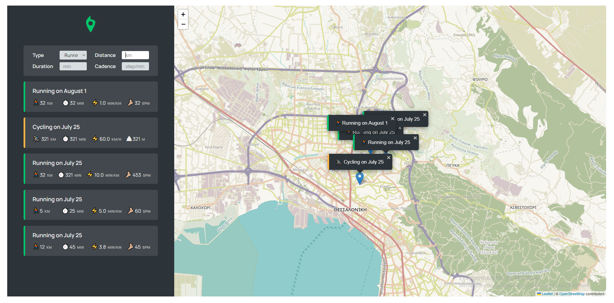

# Mapty
<h3>This is front-end website where someone can plan and save with details his training (for running and cycling).</h3>
Done as part of the Udemy course called "The Complete JavaScript Course 2022: From Zero to Expert!" by Jonas Schmedtmann<br><br>




# How to use
```
By clicking on any place of the map, a form will appear on the right, where the user can fill in information about his training in the selected place.
```
```
By right-clicking on an item from the right that corresponds to a training, then a zoom-in will be happened on the specific part of the map where the training (will) took place.
```

# Tools and services used
<ul>
<li><b>Leaflet Library</b></li>
<li><b>Parcel</b></li>
<li><b>Geolocation API</b></li>
</ul>

# Local Installation
```
git clone https://github.com/ics20072/Mapty.git or download the zip from github and extract it
Import Mapty folder to vscode
Confirm you are on "Mapty" directory
npm install
npm run start
Follow the server link that provided after build
```

# Live: 
https://minas-mapty.netlify.app
